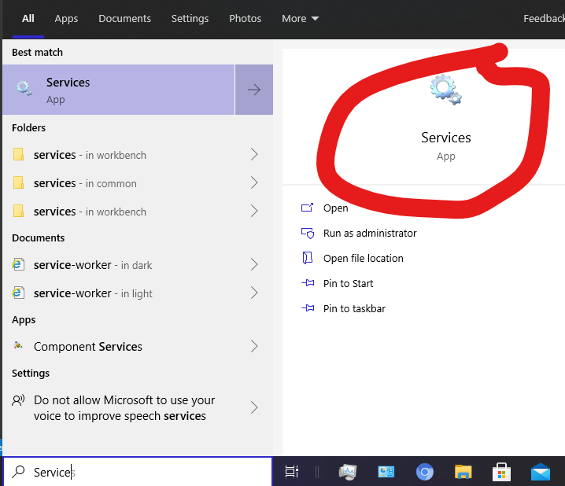
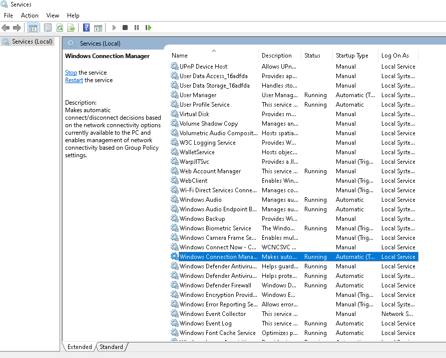
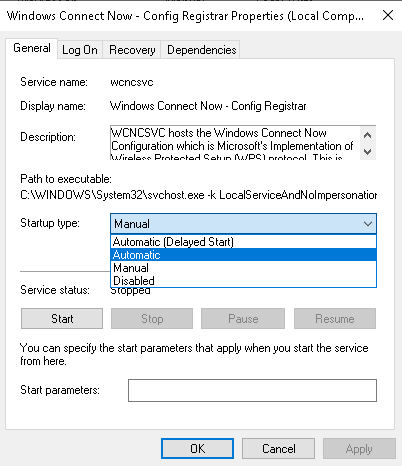
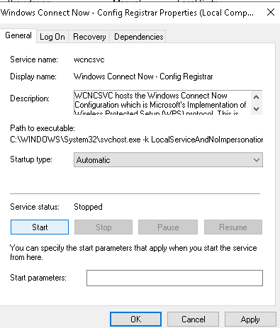
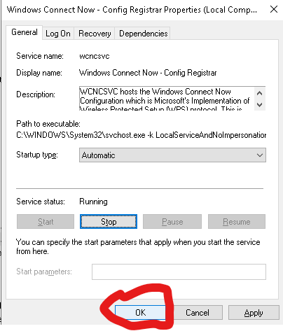
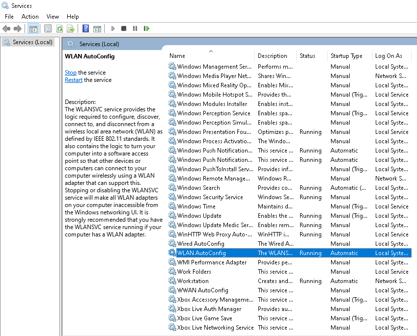

# Assalamu'alaukum Warohmatullahi Wabarokatuh  
Disini saya akan menjelaskan cara memunculkan kembali Wi-fi yang tiba-tiba hilang  

**1. Ubah Pengaturan WLAN Auto Config**  
Pertama kita cari **Services** di pencarian windows, lalu buka.  
  

  
naah setelah kita dibawa kedalam menu service selanjutnya kita cari **"Windows Conection Manager"** lalu klik 2 kali.  

langkah selanjutnya kita ubah **"Starup type"** dari *Manual* ke *Automatic*.  
  

Setelah di ubah ke Automatic, berikutnya klik **"star"**.  
  

Nah jangan lupa pastikan juga *Service status* kondisinya *Running*. selanjutnya langsung saja kita klik *ok*  
  

terakhir kita cari lagi cari **"WLAN AutoConfig"**  
  
lalu kita lakukan hal yang sama seperti yang di lakukan pada **"Windows Connection manager"**

Jika Berhasil Jangan Lupa Bersyukur Pada Allah SWT. Sekian terimakasih.  
Wassalamu'alaikum Warahmatullahi Wabarokaatuh...